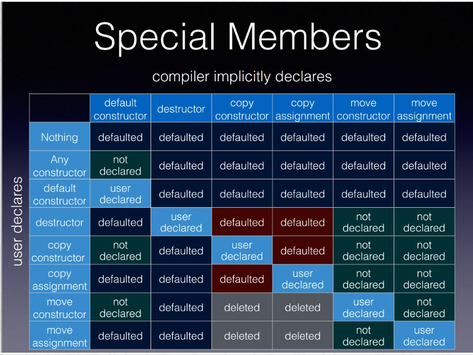
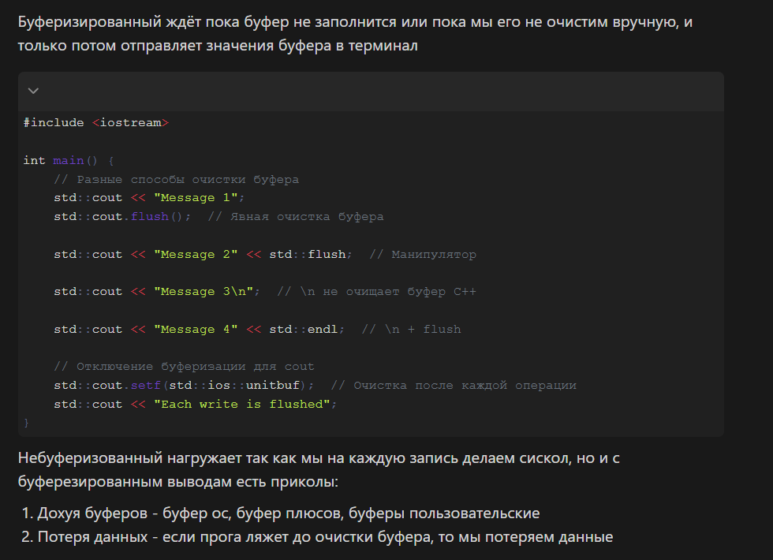
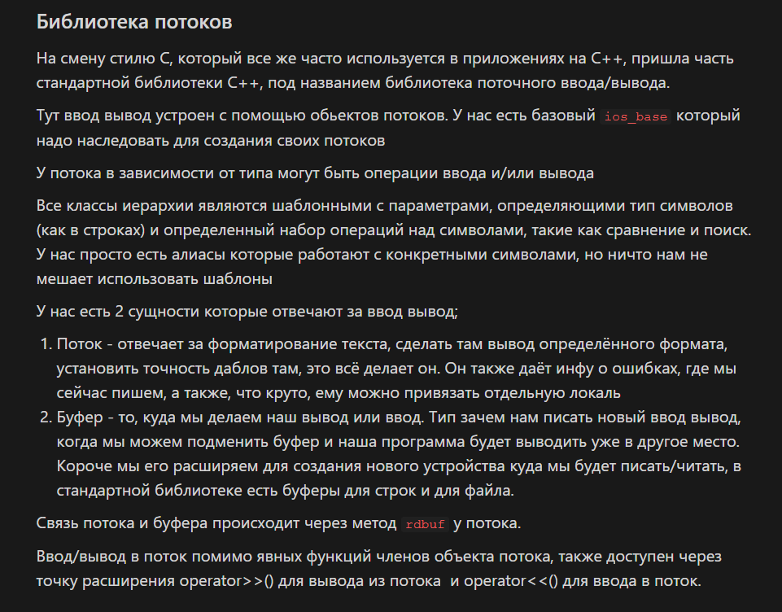
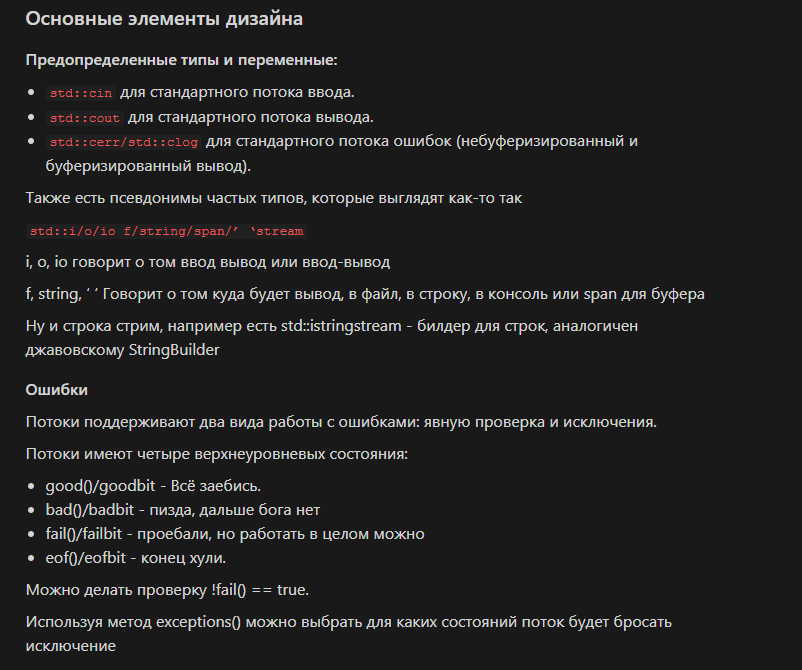
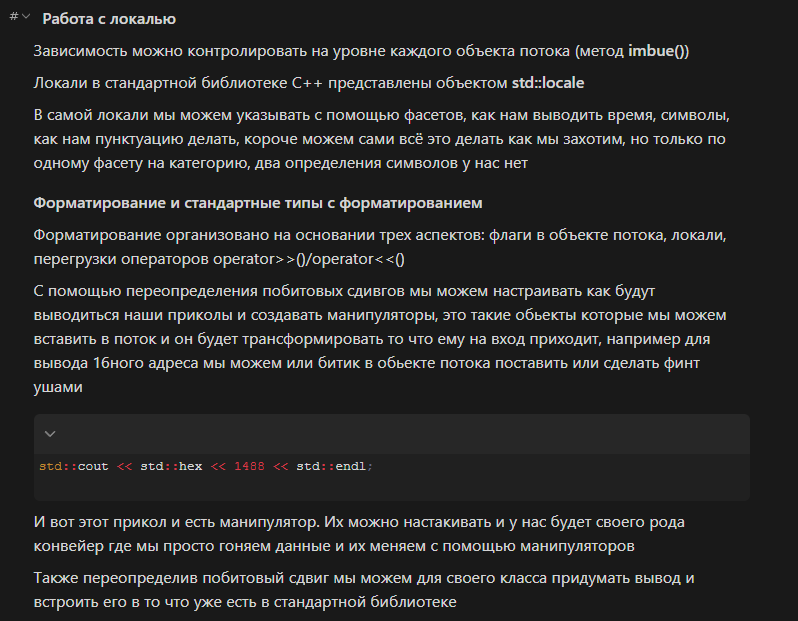
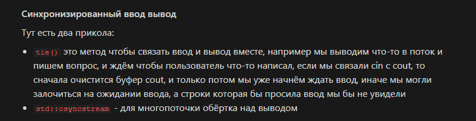
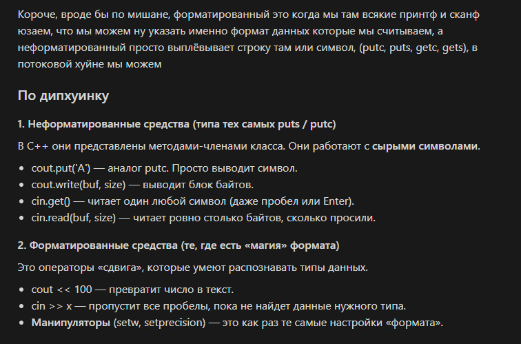

## Боже мой
## Вопрос 1
> В чем состоит дизайн работы с динамической памятью в стиле С?

При программировании на C++ можно выделить следующие стили работы с памятью:

1. Управление глобальным аллокатор C. Вся память проходик через связку ``malloc + free``, без лишних действий, но контроля маловато
2. **УПРАВЛЕНИЕ В СТИЛЕ C**. Это наиболее распространенный способ для C библиотек и C оберток. В нем при инициализации библиотеки или при каждом вызове может быть передан указатель на структуру, содержащий указатель на методы, удовлетворяющие сигнатуре ``malloc/free`` и потенциально других метод для работы с памятью.
```c
struct allocator_callback {
    void* (*alloc)(std::size_t);
    void (*free)(void*);
};

void main(){
    static const allocator_callback cb {
        .alloc = std::malloc,
        .free = std::free
    };

    init_some_library(&cb);
}
```
3. Упраление глобальным аллокатором c++. Вся память управляется через связку ``new + delete``, без лишних действий, но контроля маловато.
4. Структуры данных, знающие об аллокаторах
5. Полиморфная аллокация.


## Вопрос 2.
> В чем разница между std::memcpy() и std::memmove()? В каком случае используется каждая функция?

Обе функции нужны для копирования памяти и обладают сигнатурой
```c
void* std::memcpy(void* dest, const void* src, std::size_t n);
void* std::memmove(void* dest, const void* src, std::size_t n);
```

Отличие заключается в том, что std::memcpy не допускает перекрытий между dest и src. Это привидет к UB. Для std::memmove перекрытия это нормально и они ничего не ломают.

Однако std::memcpy быстрее, он может творить больше фокусов из-за того, что ему не нужно учитывать перекрытия

Таким образом std::memmove следует использовать, чтобы сделать сдвиг в буфере, а в остальных случаях, когда перекрытия не будет следует использовать std::memcpy


## Вопрос 3. 
> В чем свойства типа std::nullptr_t и для чего он используется?

std::nullptr_t — это тип специального литерала nullptr, введённый в C++11, чтобы нормально и типобезопасно представить “нулевой указатель”.

До С++11 все использовали NULL, но это макрос, который раскрывался либо в 0, либо в (void*)0, что не очень круто и не очень безопасно

Ключевые свойства
1. ``nullptr`` имеет собственный типа ``nullptr_t``
2. Неявно приводится к любому указателю
```c
int* p = nullptr;
double* q = nullptr;
void (*fp)() = nullptr;
```
3. Не приводится к целочисленным типам
```c
int x = nullptr; // <- doesnt work
```
4. Можно однозначно задать перегрузку
```c
f(int* x);
f(nullptr_t x)

nullptr_t x = nullptr
f(x) // <- вызовет f(nullpt///r_t x)
```


## Вопрос 4.
> Как в С++ определяется абстрактный пользовательский тип данных? Что такое идиома пустого абстрактного класса?

### Абстрактный пользовательский тип данных

Абстрактный пользовательский тип данных - это такой, в котором хотя бы одна нестатическая функция члена объявлена абстрактной с помощью модификатора =0 при объявлении функции

```c
struct Abstract {
    virtual void normal_method();
    virtual int abstract_method() = 0;
}
```

### Идиома
Идиома пустого абстрактного класса заключается в использовании абстрактного класса, который не содержит данных-членов и предназначен исключительно для наследования.

Такой класс определяет только набор чисто виртуальных функций и не может быть использован иначе как базовый.

Пустой абстрактный класс в C++ является наиболее близким аналогом интерфейса в языках Java и C#.


### Про виртуальный деструктор
Когда делаешься абстрактный пользовательский тип данных в нем нужно определять виртуальный деструктор
```c
struct Abstract {
    virtual void normal_method();
    virtual int abstract_method() = 0;
    virtual ~Abstract();
}
```

Закономерный вопрос: почему?

Это становится понятно из следующего примера
```c++

#include <iostream>

struct Base {
    void foo() {
        std::cout << "Base::foo\n";
    }

    virtual void bar() {
        std::cout << "Base::bar\n";
    }

    virtual ~Base() = default;
};

struct Derived : Base {
    void foo() {
        std::cout << "Derived::foo\n";
    }

    void bar() override {
        std::cout << "Derived::bar\n";
    }
};

int main() {
    Base* p = new Derived;
    p->foo();
    p->bar(); 
    delete p;
}

// Base::foo
/// Derived::bar
```

Прикол в том, что 
1. Если метод не виртуальный, то реализация будет выбрана **на этапе компиляции**
2. Если виртуальный, то **во время исполнения** по реальному объекту

В примере мы приводим наш ``Direved*`` к ``Base*``, что по-сути полностью сохраняет этот объект именно в виде класса ``Direved``, но если мы не укажем, что деструтор ``Base`` является ``virtual``, то по-аналогии с ``p->foo`` он вызовется именно на классе ``Base``, а нам нужен деструктор класса ``Direved``, поэтому конструктор на ``Base`` должен быть виртуальным, чтобы он работал по-аналогии с ``p->bar``


## Вопрос 5-6.
> Как работает выражения new/new[]?
> Как работает выражение delete/delete[]?

Работа с сырой памятью в С++ организована через выражения new и delete

### Виды работы с new
Заранее выделить память
```c++
void * mem = ::operator new (sizeof A);
A* obj = new (mem) A;
```
Небросающий
```c
A* obj = new (std::nothrow) A(args...);
```


### Как работает выражение new
1. Ищется и вызывается operator new, либо глобальный, либо конструируемом классе, если есть. Так же есть форма, в которой искать не приходится: 
```c++
void * mem = ::operator new (sizeof A);
A* obj = new (mem) A;
```

2. Если не получилось выделить память, то бросающий ``new`` выкинет ``std::bad_alloc``, небросающий вернет ``nullptr_t``
3. Объект конструируется согласно инициализатору
4. Если конструтор выкинул исключение вызывается ``operator delete``. При ``noexcept`` вернет ``nullptr_t``
5. Для new[], если конструктор выкинул исключение, то вызывается деструктор всех уже сконструированных объектов
6. Может выделяться больше памяти, чем ``sizeof(T)`` на всякую служебную ерунду, на выравнивание, на размер массива при ``new[]``


### Как работает delete
1. Вызывается деструктор одного объекта (delete) или деструкторы всех элементов массива (delete[])
2. Память возвращается через operator delete()

### Перегрузка operator new / operator delete
```c++
// Нельзя создать на куче. Идиома
class OnlyOnStackClass {
    void* operator new(std::size_t) = delete;
    void operator delete(void*) = delete;
    void* opeator new[](std::size_t) = delete;
    void operator delete[](void*) = delete;
}

// Нельзя создать на стеке. Идиома
class OnlyOnHeapClass {
    protected:
        OnlyOnHeapClass();
    public:
        OnlyOnHeapClass* create();
}

```


## Билет 7. 
> Какие бывают виды конструкторов в С++? Для чего предназначен каждый вид?

Виды конструкторов
1. По умолчанию
2. Копирующую
3. Перемещения
4. Конвертирующий
5. Делигирующий
6. Конструтор инициализации из списка
7. Обычный конструктор


### Конструтор по умолчанию
Конструктор по умолчанию - это конструктор, для вызова которого не нужно передавать аргументы. Такой конструктор может быть только один. Это либо конструктор без аргументов, либо такой, у которого для всех аргументов есть значение по умолчанию.


### Конструктор копирования
Создаёт новый объект на основе уже существующего. Обычно имеет вид ClassName(const ClassName&). Он копирует состояние объекта.

```c++
struct Point {
    int x, y;
    Point(int a, int b) : x(a), y(b) {}
    Point(const Point& other) : x(other.x), y(other.y) {}
};
```


### Конструктор перемещения
Используется для «перемещения» ресурсов из одного объекта в другой без копирования. Обычно это ClassName(ClassName&&). Часто применяется с динамической памятью для эффективности.
```c++
struct Buffer {
    std::vector<int> data;
    Buffer() {}
    Buffer(Buffer&& other) noexcept : data(std::move(other.data)) {}
}
```

### Конвертирующий конструктор
Позволяет создавать объект из значения другого типа. Обычно объявляется с одним параметром без explicit.
```c++
struct Point {
    int x, y;
    Point(int val) : x(val), y(val) {}
};
```

### Делигирующий конструктор
Один конструктор вызывает другой для повторного использования кода.
```c++
struct Point {
    int x, y;
    Point() : Point(0, 0) {}
    Point(int a, int b) : x(a), y(b) {}
};
```

### Конструктор инициализации из списка
Позволяет инициализировать объект списком значений {}
```c++
#include <vector>
struct MyVec {
    std::vector<int> data;
    MyVec(std::initializer_list<int> ilist) : data(ilist) {}
};

int main() {
    MyVec v = {1, 2, 3, 4};
}
```

### Обычный конструктор. Правда обычный
Любой конструктор с параметрами, не подпадающий под специальные категории. Просто создаёт объект с нужной инициализацией.
```c++
struct Point {
    int x, y;
    Point(int a, int b) : x(a), y(b) {}
};
```

### copy/move assignment
```c++
struct Buffer {
    std::vector<int> data;
    Buffer() {}
    Buffer(Buffer&&) noexcept = default;            // move constructor
    Buffer& operator=(Buffer&&) noexcept = default; // move assignment
    Buffer(const Buffer&) = default; //copy constructor
    Buffer& operator=(const Buffer&) = default // copy assignment
};
```


### default не default, все такое



## Билет 8. 
>  Когда тип в С++ является полным? Какой тип в С++ всегда является не полным?

Синтаксис языка С++ выделяет два типа конструкций:
1. Объявления - это способ введения имени в контекст программы
2. Определения - это объявления, которые полностью определяют сущность вводимую объявлением

Полностью определяет значит, что компилятор знает внутреннюю структуру сущности и её размер. То есть у него есть вся информация, чтобы создать объект этого типа, вызвать конструктор, выделить память и т.п.


Полные типы, это такие типы для которых уже было введено определение. 
Тип void всегда является не полным

## Билет 9.
> Объясните семантику перемещения в С++? Какие две конструкции языка позволяют осуществлять данную семантику?

Смысл move semantics в том, чтобы не копировать ресурсы, а переносить их. Когда мы перемещаем объект, мы просто переносим внутренние указатели на ресурсы из одного объекта в другой, оставляя исходный объект в «нулевом» или безопасном состоянии (обычно пустой контейнер, nullptr и т.д.).

Пример с вектором
```c++
vector<int> a = {1,2,3,4};
vector<int> b = std::move(a); //<-- std::move получение правосторонней ссылки
```

Есть две конструкции для такой семантики: конструктор и оператор перемещения
```c++

class Text{
    char* data;

    Text() = default;

    Text(char* data) : data(data) {}

    // move constructor
    Text(Text&& text) : data(text.data) {
        text.data = nullptr;
    }

    // move operator
    Text& operator=(Text&& text) {
        delete[] data;
        data = text.data;
        text.data = nullptr;

        return *this;
    }
}

void main() {
    char * some_data;
    Text a(some_data);
    Text b(std::move(a)); // now a.data is nullptr and b is initialized;

    Text c;
    c = std::move(b); // b.data is nullptr and c is initialized
}

```


## Билет 10.
> Чем отличается переопределение от перегрузки функции (синтаксис и семантика)?

Цитата из лекций:

Переопределение (overwrite) функции это  определение в классе наследнике нестатической функции члена с такой же сигнатурой, что и в базовом класса

Перегрузка (overload) это определение функции с таким же именем, но отличающимся ее типом


Можно и на пальцах объяснить


## Билет 11.
> Что такое перегрузка операторов в С++? Для каких целей она чаще всего используется?

Перегрузка операторов это возможность С++ по связыванию символьных конструкций языка с семантикой, определенной программистом.

Основые применения:
1. Пользовательские арифметические типы
2. DSL и так далее
3. Определение точек расширения


### Пользовательские арифметическе/pointer-like/booleany типы
```c++
// Хочется делать свои арифметические типы
class MyMatrix {
    MyMatrix operator+(const MyMatrix& matrix);
    // ...
}

// Хочется делать итераторы например pointer-like
class MyIterator {
    MyIterator operator+(const MyIterator& iterator);
}

class MyBool {
    bool empty();


    // Позволяет кастовать к bool
    // Из-за explicit только явное приведение static_cast<bool>
    explicit operator bool() {return empty();} 
}
```

### Опеределение точек расширения
std::sort полагается на то, что на объектах определен operator <, это дает нам точку расширения
```c++
class MySortable {
    bool operator<(MySortable&) = default;
}
```

#### Идиома цепочки вывода
Из метода или оператора возвращается левая константная ссылка на объект. Как в ``std::cout << "text" << std::endl``
```c++
struct Point {
    int x, y;
}

std::ostream& operator<<(std::ostream& o, const Point& p){
    return o << p.x << p.y;
}

void main(){
    std::cout << p << std::endl;
}

```

#### Конвертируемые типы
Смотри пример с bool

#### Точка расширения для структурного связывания
Чето очень узкое хз как будто. Смысл в том, что у нас можно tuple-like объекты вот так раскрыть
```c++
std::pair<int, double> p{3, 14};
auto[x,y] = p; //x=3, 14
```
мы можем делать такие же фокусы с нашим объектом, но это вот так. Нужно определить tuple_size, tuple_element, get
```c++
#include <tuple>
#include <iostream>

struct MyPair {
    int first;
    double second;
};

namespace std {
    template<>
    struct tuple_size<MyPair> : std::integral_constant<std::size_t, 2> {};
    
    template<std::size_t I>
    struct tuple_element<I, MyPair>;

    template<>
    struct tuple_element<0, MyPair> { using type = int; };

    template<>
    struct tuple_element<1, MyPair> { using type = double; };
}

template<std::size_t I>
auto get(const MyPair& p);

template<>
auto get<0>(const MyPair& p) { return p.first; }

template<>
auto get<1>(const MyPair& p) { return p.second; }

int main() {
    MyPair p{42, 3.14};
    auto [x, y] = p;
    std::cout << x << ", " << y << "\n"; 
}
```

#### Оператор индексирования
```c++
class A {
    Value& operator[](int n) {...}
}
```

#### Идиома временного прокси
```c++
#include <iostream>

struct Element {
    int value;
};

struct Proxy {
    Element& elem;

    // присваивание через прокси
    Proxy& operator=(int v) {
        elem.value = v; // обновляем элемент
        return *this;
    }

    // чтение через прокси
    operator int() const {
        return elem.value;
    }
};

struct Container {
    Element e;

    Proxy get() { 
        return Proxy{e}; 
    }
};

int main() {
    Container c;
    
    c.get() = 42;      // присвоение через прокси
    int x = c.get();   // чтение через прокси

    std::cout << x << "\n"; // 42
}
```

#### Оператор функционального вызова
```c++
class A{
    void operator()(int a, int b) {}
}
```


## Билет 12.
> Какие бывают типы указателей в С или в С++?

Простые указатели

1. Указатель на данные - типы указателей, нижележащим типом для которых, является тип хранящий данные. Разыменование таких указателей предоставляет доступ к значениям нижележащего типа 

2. Указатель на функцию - типы указателей, нижележащим типом для которых, является тип сигнатуры функции. Для таких указателей значение является представлением произвольного исполняемого кода используя которое можно перейти к его исполнению (путем совершения непрямого вызова).


## Билет 13.
> Что такое переменная в С++? Какими свойствами она обладает? Что такое класс хранения переменной и как он связан с временем жизни хранилища?

Переменная - это введенный в область видимости идентификатор имеющий тип и класс хранения. 

Про свойства в лекции ничего нет, ну хз, там CV можно поставить еще. Скорее всего свойства это как раз тип, класс хранения, идентификатор.

### Классы хранения переменной
Доступные следующие спецификаторы классы хранения
1. static — задаёт статическую длительность жизни; на уровне namespace меняет линковку на internal linkage (имя видно только внутри одного translation unit); внутри функции на линковку не влияет.

2. thread_local — задаёт потоковую длительность жизни; для каждого потока создаётся отдельный объект; сам по себе линковку не задаёт (по умолчанию external, если глобально).

3. extern — не задаёт длительность жизни; задаёт external linkage; объявляет объект, определённый в другом translation unit, сам объект не создаёт.

4. mutable — не влияет ни на длительность жизни, ни на линковку; разрешает изменять поле класса в const-объекте.

5. static thread_local — задаёт потоковую длительность жизни; static даёт internal linkage; отдельный объект для каждого потока внутри одного translation unit.

6. extern thread_local — задаёт потоковую длительность жизни; extern даёт external linkage; объявление потоковой переменной, определённой в другом translation unit.

Длительность жизни хранилищ
1. Автоматическое - для переменных в блоках исполнения или параметров функций. Хранилище выделяется на период исполнения или вызова функции
2. Статическое - хранилище достпно в течении всей жизни программы
3. Динамическое - хранилище, создаваемое и разрушаемое в течение жизни программы
4. Локально для потока - хранилище уникальное для каждого потока программы, существует пока существует поток

## Билет 14.
> Для чего нужен константный метод и когда он будет вызван? Для чего используется ключевое слово mutable в рамках определения пользовательского типа данных?

Семантика константных методов заключается в том, ни один из членов данных нельзя изменить внутри метода и вызывать можно только константные методы.

### Когда он будет вызван
Вот эта штука называется идиомой пары константного и не константного метода
Если объект не константный, то вызываем неконстантный метод, он удобнее, если объект константный, то вызываем неконстантный метод.
```c++
class A {
    int a;

    int get_a() {return a;}
    const int& get_a() const {return a;}
}


A a;
const A ca;

int& a_a = a.get_a() // Будет вызван не конст метод, потому что a не константный
const int& ca_a = ca.get_a() // Будет вызван конст метод, потому что са константный
```
### mutable
Данную семантику ослабляет квалификатор членов данных mutable, который позволяет изменять такой член данных в теле константного метода.

```c++

class A {
    mutable int canBeChangedInConst;
    int cannotBeChangedInConst;
}
```


## Билет 15.
> Что такое и как реализуются функциональные объекты в С++? Какие функциональные объекты, представленные в стандартной библиотеке вы знаете?

Функциональный объект - это объект, для которого перегружен оператор функционального вызова ``operator()``

Пример:
```c++
class FunctionalObject {
    int operator()(int x) { return x * x; }
}
```

### Функциональные объекты стандартной библиотеки
#### std::function
**Зачем нужен:**  
Универсальный *type-erasure* контейнер для любого вызываемого объекта  
(функции, лямбды, функторы, `std::bind` и т.д.) с заданной сигнатурой.

**Что делает:**  
Хранит *что угодно вызываемое*, если оно совместимо по сигнатуре.

**Важно помнить:**  
- Медленнее прямого вызова (виртуальность + аллокации)
- Copyable
- Может быть пустым

```cpp
#include <functional>

int add(int a, int b) { return a + b; }

std::function<int(int, int)> f = add;

int x = f(2, 3);
```


#### std::move_only_function
Вот тут пример лямбды l, она зависит от unique_ptr, а так как std::function копирует функцию, то он бы попытался скопировать unique_ptr и упал, а std::move_only_function отрабатывает, потому что она ниче не копирует, а хранит ссылку типа
```cpp
auto l = [p = std::make_unique<int>(10)] {
    return *p;
};

std::move_only_function<void()> f = l;
auto x = f();

```

#### std::mem_fn
Позволяет вызывать метод через объект или указатель, удобно для алгоритмов.
```cpp
#include <functional>

struct A {
    int x;
    int get() const { return x; }
};

A a{10};

auto f = std::mem_fn(&A::get);
int v = f(a);
```

#### std::hash
Функция хеширования для использования в unordered_map, unordered_set.
```cpp
#include <functional>

std::hash<int> h;
size_t x = h(42);
```

Можно задать свой хэш
```cpp
struct Point {int x, int y};

template<>
struct std::hash<Point> {
    size_t hash(Point& p) {
        return std::hash<int>{}(p.x) + std::hash<int>{}(p.y);
    }
}
```


#### std::less
Стандартный компаратор "меньше". Вызывает operator<.
```cpp
#include <functional>

std::less<int> cmp;
bool ok = cmp(1, 2); // true
```

#### std::identity
Функция "верни аргумент как есть".

Делает: ``f(x) -> x``

```c++
#include <functional>

std::identity id;
int x = id(5); // 5
```

#### std::not_fn
Инвертирует результат предиката
```cpp
#include <functional>

auto is_even = [](int x) { return x % 2 == 0; };
auto is_odd  = std::not_fn(is_even);

bool a = is_odd(3); // true
```

## Билет 16.
> Что такое "пользовательские арифметические типы данных", "типы похожие на указатель" и "типы похожие на буль"?

Смотри билет 11

## Билет 17.
> Что такое схема контейнер-итератор-алгоритм? В чем её сильные и слабые стороны?

Схема контейнер-итератор-алгоритм - это базовый паттерн STL в C++. В этой схеме контейнер хранит даныне, итератор это абстракция указателя на элементы контейнера, алгоритм это функция, которая что-то делает с контейнером, используя итераторы

```c++
#include <vector>
#include <algorithm>
#include <iostream>

int main() {
    std::vector<int> v = {3,1,2};
    std::sort(v.begin(), v.end()); // алгоритм работает через итераторы
    for(auto x : v) std::cout << x << " ";
}

```


Сильные стороны этой модели:
1. Разделение обязанностей
2. Как следствие гибкость элементов системы

Слабые стороны этой модели:
1. Затруднена композиция алгоритмов, нужны промежуточные контейнеры или итераторы
2. Не поддерживается ленивое выполнение
3. Алгоритмы не могут полагаться на внутреннее устройство контейнеров, что снижает их эффективность
4. Читаемость кода значительно хуже.


## Билет 18.
> Какие бывают типы контейнеров в С++? Назовите представителей каждого типа контейнеров?

Стандартная библиотека C++ предоставляет следующие типы контейнеров:
1. Непрерывный
2. Последовательный
3. Ассоциативный
4. Неупорядоченный ассоциативный 
5. Адаптер контейнер
6. Невладеющая обертка

### Непрерывные контейнеры
Непрерывные контейнеры гарантируют непрерывное расположение объектов в виртуальной памяти и как следствие доступ за константное время.

К ним относятся 
- std::array
- std::bitset
- std::vector
- std::basic_string

### Последовательные контейнеры
Последовательные контейнеры это хранилища для произвольных объектов, которые предоставляют доступ по итератору к следующему и предыдущему элементу за константу

К ним относятся
- std::deque
- std::forward_list
- std::list

### Ассоциативные контейнеры
Ассоциативные контейнеры хранял элементы соблюдая порядок, в них вставка, удаление и поиск элемента проходит за логарифмическую сложность O(log(N)), каждый элемент хранится в своем отрезке памяти, порядок обхода элементов определен порядком на них или указывается параметром шаблона.

К ним относятся
- std::map
- std::set
- std::multiset
- std::multimap

### Неупорядоченные ассоциативные контейнеры
Неупорядоченные ассоциативные контейнеры хранят элементы таблично, вставка, удаление и поиск аммортизированно за O(1), каждый элемент хранится в своем отрезке памяти, порядок обхода элементов неопределен

К ним относится
- std::unordered_map
- std::unordered_set
- std::unordered_multimap
- std::unordered_multiset

### Адаптер контейнеры
Адаптеры контейнеров не хранят данные сами напрямую, они «оборачивают» другой контейнер и предоставляют другой интерфейс доступа.

Обычно ограничивают операции: например, стек работает только как LIFO, очередь — как FIFO.

Основная идея: использовать возможности базового контейнера, но через упрощённый интерфейс.

К ним относятся:
- std::stack — стек, обычно оборачивает deque или vector.
- std::queue — очередь, FIFO, оборачивает deque или list.
- std::priority_queue — приоритетная очередь, реализуется через vector + куча.

### Невладеющие обертки
Невладеющие обёртки не владеют памятью, а просто ссылаются на существующие данные.Они позволяют работать с контейнерами или массивами, не копируя и не управляя ресурсами. Используются для безопасного доступа к данным или передачи их в функции без копирования.

Примеры:
- std::span<T> — «вид» на массив или контейнер, позволяет проходить по элементам через итераторы.
- std::string_view — «вид» на строку, не владеет памятью строки.

Идея: уменьшение накладных расходов и копирований, безопасный доступ к уже существующим данным.

## Билет 19.
> Какие виды мьютексов в С++ вы знаете? Какие проблемы решает каждый из видов мьютексов?

### Виды мьютексов в C++
| Мьютекс                     | Проблема, которую решает                     | Особенности                                                                 |
|------------------------------|--------------------------------------------|----------------------------------------------------------------------------|
| `std::mutex`                 | Взаимное исключение (mutual exclusion)     | Простой мьютекс, не рекурсивный; блокирует поток до освобождения           |
| `std::recursive_mutex`       | Рекурсивная блокировка одним потоком       | Позволяет одному потоку захватывать мьютекс несколько раз подряд            |
| `std::timed_mutex`           | Избежание deadlock / таймаут               | Попытка захвата мьютекса с ограничением времени                             |
| `std::recursive_timed_mutex` | Рекурсивность + таймаут                     | Рекурсивный мьютекс с поддержкой таймаута                                   |
| `std::shared_mutex` (C++17)  | Производительность при множестве читателей | Разделяет блокировку на `shared` (много читателей) и `exclusive` (писатель)|


### Виды lock-обёрток в C++

| Лок                            | Мьютекс/сценарий работы                        | Особенности                                                                 |
|--------------------------------|-----------------------------------------------|----------------------------------------------------------------------------|
| `std::lock_guard`              | Любой мьютекс                                  | RAII-обёртка; блокирует при создании, разблокирует при уничтожении объекта  |
| `std::unique_lock`             | Любой мьютекс                                  | RAII + гибкость; можно вручную `lock/unlock`, поддерживает таймауты, transfer ownership |
| `std::scoped_lock` (C++17)     | Один или несколько мьютексов                  | RAII, блокирует все переданные мьютексы одновременно; предотвращает deadlock при нескольких мьютексах |
| `std::lock`                     | Несколько мьютексов                            | Функция, блокирует все мьютексы одновременно без риска deadlock            |
| `std::try_lock`                 | Несколько мьютексов                            | Пытается захватить несколько мьютексов сразу; если не удаётся — освобождает все захваченные |


Пример для unique_lock от чатджпт
```c++
#include <iostream>
#include <mutex>
#include <thread>

std::mutex mtx;

void do_work() {
    std::cout << "Работаем в критической секции\n";
    // Симуляция вызова функции, которая может блокировать другой мьютекс
    std::this_thread::sleep_for(std::chrono::milliseconds(100));
}

void thread_func() {
    std::unique_lock<std::mutex> lock(mtx); // захват мьютекса
    std::cout << "Thread вошёл в критическую секцию\n";

    // временно отпускаем мьютекс
    lock.unlock();  
    do_work(); // можем делать что-то, не блокируя других потоков
    lock.lock();   // снова блокируем мьютекс

    std::cout << "Thread снова в критической секции\n";
}

int main() {
    std::thread t1(thread_func);
    std::thread t2(thread_func);

    t1.join();
    t2.join();
}

```

## Билет 20.
> Что такое "short-circuiting" в С++?

Short-circuiting - это поведение логических операторов `&&` и `||`, при котором вторая часть выражения не вычисляется, если результат уже известен.

- AND (`&&`): если первый операнд `false`, второй не вычисляется (`false && ... = false`).
- OR (`||`): если первый операнд `true`, второй не вычисляется (`true || ... = true`).

Пример:

```cpp
bool f() { std::cout << "f() вызвана\n"; return true; }

bool a = false;
bool result = a && f(); // f() не вызовется

bool b = true;
bool result2 = b || f(); // f() не вызовется
```


## Билет 21.
> Какие компиляторы для С++ вы знаете? Что входит в типичный состав поставки для компилятора?

### Хайповые компиляторы
- g++ часть проекст GCC. Стандартная библиотека libstdc++
- clang++ часть проекта LLVM. Стандартная библиотека libc++
- MSVC от Microsoft. Стандртная библиотека Visual C++

### Что входит в состав поставки

### Стандартная поставка компилятора
- **Компилятор** — переводит исходный код (C/C++) в ассемблер или объектный код, выполняя синтаксический и семантический анализ, оптимизации.

- **Ассемблер** — преобразует ассемблерный код в **объектный файл**.  
  Ассемблерный код — человекочитаемые инструкции CPU.  
  Объектный код — бинарный машинный код + таблицы символов и релокаций, но **ещё не исполняемый**.

- **Линковщик** — объединяет объектные файлы и библиотеки в исполняемый файл или библиотеку, разрешая символы и адреса.

- **Стандартные и runtime-библиотеки** — реализация стандартной библиотеки C++ и runtime-поддержки (память, исключения, RTTI, потоки).

- **Утилиты работы с AST** — инструменты анализа и трансформации кода на уровне абстрактного синтаксического дерева (линтинг, рефакторинг).

- **Санитайзеры** — инструменты динамического анализа, находят ошибки памяти, гонки данных и неопределённое поведение во время выполнения.

- **Аллокаторы** — реализации управления динамической памятью, оптимизированные под производительность или отладку.

- **Профилировщики** — собирают данные о производительности: время выполнения, горячие функции, использование ресурсов.

- **Отладчики** — позволяют пошагово выполнять программу, смотреть стек вызовов, память и значения переменных.

- **IDE** — интегрированная среда разработки, объединяющая редактор, сборку, отладку и анализ кода.


## Билет 22.
> Какие определены специальные функции члены пользовательского типа данных? Что выражают идиомы "Правило пяти" и "Правило нуля"?

### Специальные функции
1. Конструктор
2. Деструктор
3. Конструктор копирования
4. Конструктор перемещенния
5. Оператор копирования ``A& operator=(const A&)``
6. Оператор перемещения ``A& operator=(A&&)``

### Правило нуля и правило пяти
**Правило нуля**: нужно стараться не объявлять никаких специальных функций членов
**Правило пяти**: если объявили какую-то, то нужно объявить все. К правилу пяти относятся последние пять.


## Билет 23.
> Какие составные типы данных, определенные в С или в С++ вы знаете? Каковы их свойства?

- Указатели
- struct
- Битовые поля
- union
- class 
- Массив
- enum
- enum class


### Указатели
1. Зануляемость - предоставленно отдельное значение, обозначающее пустоту
2. Реферальность - тип позволяет сослатсья на значение нижележащего типа
3. Индексируемость - типа предосталвяет возможность обратится к нижележащему типу со сдвигом относительно значения указателя, равным размеру нижележащего типа умноженного на индекс
4. Aрифметические операции - инкремент и декремент значения на интегральные типы
5. Поддержка сравнения значений указателей

### Struct
Структура - это способ определить тип-произведение в языке C++. Данные располагаются по какому-то строгому алгоритму. Каждому полю сопоставляется тип, структура может быть пустой.

### Битовые поля
Битовые поля - это способ организации доступа к отдельным битам. Они нужны так, как минимальная адрессуемая единица это 1 байт, поэтому для битов вводится дополнительная конструкция. Битовые поля 

```c++
#include <iostream>

struct Flags {
    unsigned is_ready : 1;
    unsigned has_error : 1;
    unsigned mode : 2;
};

int main() {
    Flags f{};

    f.is_ready = 1;
    f.has_error = 0;
    f.mode = 3;

    std::cout << f.is_ready << " "
              << f.has_error << " "
              << f.mode << "\n";
}
```


### Union
Способ задать тип-сумму. 
- Не больше, чем самый большой тип + его выравнивание
- Тоже есть какие-то строгие правила
- Нельзя тэгировать активный. По-человечески, это просто значит, что нужно указывать к какому обращение


### Массив
Массивы - представляют собой набор из известного количества последовательно расположенных в памяти объектов нижележащего типа. Типы массивов учитывают требования по выравниванию и размер нижележащего типа при определении размера и расположения объектов.

### Перечесления
Перечесления - это способ задать именнованные константы без введения переменных 

## Билет 24.
> Какие способы приведение типа в С и С++ вы знаете? Для чего используется каждый из способов?

| Каст               | На классах                                | Особенности                               |
|-------------------|-------------------------------------------|-------------------------------------------|
| C-style cast       | `(T)obj`                                  | Вызовет user-defined `operator T()`      |
| static_cast        | `static_cast<T>(obj)`                     | Явно и безопасно, тоже вызывает `operator T()` |
| dynamic_cast       | `dynamic_cast<Derived*>(basePtr)`         | Для полиморфных классов, проверка runtime |
| reinterpret_cast   | `reinterpret_cast<OtherClass*>(ptr)`     | Побитовое приведение, очень опасно       |
| const_cast         | `const_cast<MyClass*>(ptr)`               | Снимает/добавляет const                  |
| explicit operator  | `explicit operator T()`                   | Контролирует неявное приведение          |


## Билет 25.
> Что такое "универсальная ссылка" или "пересылаемая ссылка"? Чего позволяет добиться использование функции std::forward()?

Для начала нужно понять, как работает ебанное схлопывание ссылок

Предположим, что у нас
```c++
template<class Y>
void foo(Y& x);
```

Теперь вот первая хуйня это как-то выведенный Y, а потом примененная ссылка. Тогда вот получаем такую табличку:
```
T& (&) => T&
T& (&&) => T&
T&& (&) => T&
T&& (&&) => T&&
```

На всякий случай еще раз, что значит эта блядская таблица. Вернемся к примеру: допустим Y это какой-нибудь int&&, тогда в функции ``foo`` мы имеем int&& (&) это третий пример. И в функции ``foo`` мы будем ожидать int&

### Универсальная ссылка
Универсальная ссылка имеет вид
```c++
template<class T>
void foo(T&& x);

// T - шаблонный параметр без CV
// Тип выводится, а не задан явно
```

Почему универсальная ссылка. Заметим, что при применении && мы можем получить два типа: T& и T&&, то есть
```c++
int a = 10;
foo(a) // a <- a - это lvalue, то есть взяв тип T и применив к нему && мы получили &, значит это был тип Y& ну или в нашем случае int&, то есть T=int&
foo(10) // a <- a это rvalue, то есть взяв тип T и применив к нему && мы получили &&, значит это был тип Y ну или взял в нашем случае int, то есть T=int
```

Тогда внутри функции мы работаем с двумя возможными типами int& и int&&, но если мы вызовем какую-то другую функцию, то значение у нас будет lvalue и поэтому мы используем std::forward
```c++
#include<iostream>

void bar(int& x) {std::cout << "lvalue" << std::endl;}
void bar(int&& x) {std::cout << "rvalue" << std::endl;}

template<class T>
void foo(T&& x) {
    bar(std::forward<T>(x));
}


int main() {
    int x =0;
    foo(x);
    foo(0);
    return 0;
}
```

``std::forward`` делает ``static_cast<T&&>`` и по схлопыванию ссылок для & входа, получает & на выходе и для && входа получает && на выходе. За счет этого мы можем дальше передать rvalue ссылку, как rvalue ссылку, а lvalue ссылку как lvalue ссылку.


## Билет 26.
> Что такое и как реализуется идиома стирания типа в С++? Назовите классы стандартной библиотеки, которые используют данную идиому

Type erasure — это идиома, при которой конкретный тип объекта скрывается за единым интерфейсом путём сочетания шаблонов и виртуального полиморфизма, позволяя работать с разными типами как с одним.

Все хотят писать как в замечательной джаве
```java
IDrawable obj = new Square();
obj.draw();
```

Но в плюсах такие фокусы не канают из-за object-slicing, поэтому нужно изъебываться

```c++
struct IDrawableConcept {
    virtual void draw() = 0;
};

struct Square : IDrawableConcept {
    void draw() override { std::cout << "Draw a square" << std::endl; }
};

struct Circle : IDrawableConcept {
    void draw() override { std::cout << "Draw a circle" << std::endl; }
};

class IDrawable {
    private:
        std::unique_ptr<IDrawableConcept> drawable;
    public:
        template<T>
        IDrawable(T drawable) : drawable(std::make_unique<T>(drawable)) {};
        void draw { drawable->draw(); }
};


int main () {
    IDrawable square = Square{};
    IDrawable circle = Circle{};
    square.draw();
    circle.draw();
}
```


### Примеры в стандартной библиотеке
#### std::function
```c++
#include <iostream>
#include <functional>

void free_func(int x) { std::cout << "free_func: " << x << "\n"; }

int main() {
    std::function<void(int)> f1 = free_func;       // обычная функция
    std::function<void(int)> f2 = [](int x){       // лямбда
        std::cout << "lambda: " << x << "\n"; 
    };

    f1(10); // free_func: 10
    f2(20); // lambda: 20
}
```

#### std::any
```c++
#include <iostream>
#include <any>
#include <string>

int main() {
    std::any a = 42;                 // int
    a = std::string("hello");        // меняем тип на string

    try {
        std::cout << std::any_cast<std::string>(a) << "\n"; // hello
    } catch (const std::bad_any_cast& e) {
        std::cout << "bad cast\n";
    }
}
```

#### std::shared_ptr<void>
```c++
#include <iostream>
#include <memory>
#include <string>

int main() {
    std::shared_ptr<void> ptr1 = std::make_shared<int>(100);
    std::shared_ptr<void> ptr2 = std::make_shared<std::string>("hello");

    std::cout << *std::static_pointer_cast<int>(ptr1) << "\n";
    std::cout << *std::static_pointer_cast<std::string>(ptr2) << "\n";
}
```


## Билет 27.
> Что такое секция доступа по умолчанию? В чем её особенность для разных пользовательских типов данных?

Секция доступа по умолчанию — это уровень доступа, который применяется ко всем членам класса, если явно не указать public, protected или private.

Для Union и Struct это public
Для Class это private


Наследование это мб немного про другое, но при наследовании доступ членов тоже изменяется. Если наследование public, то public -> public, protected->protected, private -> недоступен, если protected, то public -> protected, protected->protected, private->недоступен, если private, то public/protected->private, private->недоступен 

Для Union и Struct наследование public
Для Class наследование private


## Билет 28.
> Что такое специализация шаблона? Какие виды специализации шаблона вы знаете? В чем отличие специализаций шаблонов функций и пользовательских типов данных?

**Специализация шаблона** — это когда мы берём общий шаблон (`template`) и делаем **особый вариант для конкретного типа или комбинации типов**.


```cpp
template<typename T>
struct Printer {
    void print(T value) { std::cout << value << "\n"; }
};

template<>
struct Printer<const char*> {
    void print(const char* value) { std::cout << "String: " << value << "\n"; }
}

int main() {
    Printer<int> p1;
    p1.print(42);

    Printer<const char*> p2;
    p2.print("Hello"); 
}
```


Виды специализации: частичная и полная


Разница между специализацией функций и пользовательских типов в том, что нельзя сделать частичную специализацию. Для нее используется перегрузка шаблонов
```c++
template <typename T, typename U>
void foo(T x, U y);

// Ошибка, это частичная специализация функции!
// template <typename T>
// void foo<T, int>(T x, int y);
```


## Билет 29. 
> Какие основные классы вы знаете в стандартной библиотеке времени и для чего они нужны?
std::chrono - библиотека времени и дат
В состав входят:
1. Продолжительность. Представлена через ``std::chrono::duration<Rep, Period>``. Первая хуйня это число, вторая это отношение к секунде, то есть ``std::chrono::duration<int, std::ratio<60>>(10)`` это 10 минут. 
2. Штампы времени. Представлена через std::chrono::time_point<Clock, Duration>, где Clock — источник времени (system_clock, steady_clock и т.д.), а Duration — единицы измерения (обычно Clock::duration), например ``std::chrono::time_point<std::chrono::system_clock, std::chrono::seconds> t(0)`` — момент времени, равный 0 от эпохи (1970-01-01 00:00:00 UTC), а с помощью ``auto now = std::chrono::system_clock::now()`` можно получить текущий момент времени, к которому можно прибавлять или вычитать duration (now + std::chrono::minutes(10) → через 10 минут, later - now → разница в виде duration).
3. Часы. ``std::system_clock``, ``std::steady::clock``, ``std::high_resolution_clock``
4. Календарь. ``day/month/year``
5. Временные зоны. ``std::chrono::time_zone``


## Билет 30.
> Какие блоки лямбда выражения вы знаете? В чем состоит их задача и особенности?

### Общая структура лямбды
```
[capture](parameters) mutable(optional) -> return_type(optional) { body }
```

#### capture
Блок захвата. Определяет к каким внешним переменным будет иметь доступ лямбда выражение. Работает по следующему принципу
```
[] <- ниче не захватить
[&] <- захватить все по ссылке
[=] <- захватить все по значению, то есть скопировать с модификатором const
[&x] <- захватить x по ссылке
[x] <- захватить x по значению, то есть скопировать c const
[x, y, &] <- захватить x и y по значению c const, а все остальное по ссылке
```

#### parameters
как у обычной функции

#### mutable (optional)
опциональная штука, но нужная так как при копировании значений они имееют квалификатор const, а мы их можем захотеть изменять, тогда мы задаем лямбду mutable
```c++
[x]() mutable -> {x+=5; return x;}
```
 
#### return_type можно указать опционально
```c++
[]() -> int {return 10;}
```

#### body
сама функция


## Билет 31.
> Какие бывают пространства имен в С++ и для чего они используются?

#### user-defined nested namespace
Создаём сами, можно вкладывать друг в друга
```c++
namespace A::B {
    int x;
}
```

#### anonymous namespace
Видимость только внутри текущего файла
```c++
namespace {
    int secret = 42; // доступно только в этом файле
}
```

#### std namespace
Для стандартной библиотеки C++, можно использовать `using` или дописывать новые функции (редко)
```c++
namespace std {
    template<>
    struct hash<MyType> {
        size_t operator()(const MyType& t) const {
            return std::hash<int>()(t.x) ^ (std::hash<int>()(t.y) << 1);
        }
    };
}
```

#### inline namespace
Элементы видны напрямую, удобно для версионирования API
```c++
namespace lib {
    inline namespace v2 {
        void foo() {}
    }
    namespace v1 {
        void foo() {}
    }
}
lib::foo();       // версия v2
lib::v1::foo();   // версия v1
```

#### extern namespace
Объявляем существующее пространство имён из другой единицы трансляции
```c++
extern namespace lib;
lib::foo();

```

#### namespace alias
Создаём короткое имя для длинного пространства имён
```c++
namespace long_name::v1::v2 { void foo(); }
namespace ln = long_name::v1::v2;
ln::foo(); // коротко
```

#### локальный using namespace
Используем namespace только внутри функции или блока
```c++
void f() {
    using namespace std;
    cout << "Hello"; // только здесь
}
```


## Билет 32.
> Что такое время жизни объекта в C++?

Время жизни объекта в C++ — это промежуток времени от **создания объекта** до его **уничтожения**, т.е. период, когда объект существует в памяти и доступен для использования.

### Длительность жизни хранилищ
1. **Автоматическое** — для локальных переменных в блоках или параметров функций. Хранилище выделяется на время исполнения блока или вызова функции, автоматически уничтожается при выходе.
2. **Статическое** — хранилище доступно на протяжении всей жизни программы. Примеры: глобальные переменные, `static` внутри функции или класса.
3. **Динамическое** — хранилище создаётся через `new` и уничтожается через `delete`. Время жизни управляется программистом и может выходить за пределы функции.
4. **Локально для потока** — с использованием `thread_local`. Каждому потоку создаётся собственная копия переменной, она живёт пока существует поток.

### Временные объекты
Временные объекты (например, `std::string("abc") + "def"`) живут до конца **полного выражения**, но их время жизни можно продлить:
- через `const T& x` (ссылка на константу),
- через `T&& x` (rvalue-ссылка),
что позволяет безопасно использовать временный объект дольше.


## Билет 33.
> Что такое гонки данных в С++? Как избежать гонки данных?

### Отношения упорядоченности
- упорядочено до - гарантированный порядок исполнения выражений в одном потоке. 
- синхронизуется с - специальный операции, которые синхронизованы между потоками. ``mutex.(un)lock()``, ``atomic_variable`` и т.д.
- межпоточно происходит до - при наличии синхронизуется с появляется межпоточный порядок
- происходит до - обобщения порядка выполнения.


### Гонки данных
Гонка данных возникает, если:

- два (или более) потока
- обращаются к одному и тому же объекту памяти
- хотя бы один доступ — запись
- и между этими доступами нет отношения happens-before
- и доступы не атомарные

Гонка данных не возникает, если есть отношение происходит до, поэтому для их предотвращения проще всего ввести это отношение. Для этого используются примитивы синхронизации.

- ``std::atomic``
- ``std::mutex``
- ``std::barier``
- ``std::semaphore``
- ``std::latch``
- ``std::condition_variable``


## Билет 34.
> Какая семантика определена для видов доступа к членам пользовательского типа данных?

### Семантика доступа к членам пользовательского типа в C++

В C++ для членов пользовательских типов (`class`, `struct`, `union`) определены три уровня доступа:

- `public` — доступен из любого контекста, формирует публичный интерфейс типа.
- `protected` — доступен внутри класса и его производных, предназначен для наследников.
- `private` — доступен только внутри самого класса, скрывает детали реализации.

Спецификаторы доступа задают компиляционные ограничения на использование членов и обеспечивают инкапсуляцию; на размещение в памяти и время жизни объектов не влияют.

Значения по умолчанию: `class` — `private`, `struct` и `union` — `public`.


## Билет 35.
> Какие виды определения перечислений в С++ вы знаете? Какие свойства у каждого вида? Для чего используется каждый вид?

### 1. unscoped перечисление (enum)
Синтаксис:
enum Color { Red, Green, Blue };

Свойства:
- Имена элементов перечисления попадают в окружающее пространство имён
- Допускается неявное приведение к целочисленным типам
- Возможны конфликты имён между разными enum

Назначение:
- Наследие C
- Флаги в старом коде

### 2. Областьное перечисление (enum class)
Синтаксис:
enum class Color { Red, Green, Blue };

Свойства:
- Элементы доступны только через имя перечисления (Color::Red)
- Не допускается неявное приведение
- Исключены конфликты имён
- Базовый тип по умолчанию int

Назначение:
- Современный C++ (начиная с C++11)
- Рекомендуемый вариант по умолчанию

### 3. Перечисление с явно заданным базовым типом
Синтаксис:
enum Color : uint8_t { Red, Green, Blue };
enum class ErrorCode : int32_t { Ok = 0, Fail = -1 };

Свойства:
- Явно задан размер и знаковость
- Предсказуемое представление в памяти
- Удобно для бинарных интерфейсов
- Работает как для enum, так и для enum class

Назначение:
- Сетевые протоколы
- Работа с железом
- Сериализация и бинарные форматы
- Контроль ABI
- Экономия памяти

### 4. Предварительное объявление перечислений

Возможны только для enum class или enum с явно заданным базовым типом.

Синтаксис:
enum class Color : uint8_t;

Свойства:
- Можно объявить без определения
- Требуется указание базового типа
- Размер типа известен на этапе объявления


## Билет 36.
> Что такое список требований шаблона? Как и для чего в язык было введено понятие "концептов"?

Список требований шаблона — это набор условий на параметры шаблона, определяющих допустимые типы и операции, при которых шаблон может быть инстанцирован


Делают код и ошибки значительно понятнее 

```c++
template <class T>
concept Swappable = requires (T a, T b) {
    std::swap (a, b);
}

template <Swappable T>
void function_for_swappables(T a, T b) {}

template <class T>
requires Swappable<T>
void another_function(T a, T b) {}
```


## Билет 37.
> Что такое лямбда выражение? Как оно реализовано в С++?

Лямбда-выражение — это анонимная функция, которую можно определить прямо на месте и передать куда угодно (в переменную, в аргумент функции, в контейнер и т.д.).
То есть это функция без имени, которая может захватывать переменные из внешней области видимости.


В с++ задается
```c++
[] () (mutable) -> (return type) {}
```

Работает по принципу создания анонимного класса с реализацией ``operator ()``


## Билет 38.
> Что такое шаблон в С++? Какие виды шаблонов бывают? Какие требования предъявляются к шаблону при определении и инстанциации и как с ними связана идиома утиной типизации?

### 1. Что такое шаблон
Шаблон (template) в C++ — это **обобщённый механизм**, позволяющий писать функции или классы, которые могут работать с разными типами данных без повторного копирования кода.  
Идея: создаём «форму» или «шаблон» кода, а компилятор при использовании создаёт конкретную версию под указанный тип.

### 2. Виды шаблонов

1. **Функциональные шаблоны (Function Templates)**  
   - Позволяют писать функции, работающие с разными типами.  
   - Пример:
     ```cpp
     template <typename T>
     T max(T a, T b) {
         return (a > b) ? a : b;
     }
     ```

2. **Классовые шаблоны (Class Templates)**  
   - Позволяют создавать классы, параметризованные типами.  
   - Пример:
     ```cpp
     template <typename T>
     class Stack {
         std::vector<T> data;
     public:
         void push(const T& value);
         T pop();
     };
     ```

3. **Шаблоны с несколькими параметрами**  
   - Можно передавать несколько типов или значений:
     ```cpp
     template <typename T, int N>
     class Array { T data[N]; };
     ```

4. **Шаблоны с не типовыми параметрами (non-type template parameters)**  
   - Параметры могут быть константами (int, size_t, указатели).  

5. **Шаблоны переменного числа параметров (Variadic Templates)**  
   - Для создания функций/классов с произвольным количеством типов:
     ```cpp
     template <typename... Args>
     void printAll(Args... args);
     ```


### 3. Требования к шаблону

1. **Определение шаблона**  
   - Должно быть доступно компилятору **до момента инстанциации** (обычно в заголовочном файле).  

2. **Инстанциация шаблона**  
   - Компилятор создаёт конкретный тип/функцию только тогда, когда шаблон используется с определёнными типами.  
   - Требования к типам параметров:
     - Типы должны поддерживать все операции, используемые в шаблоне (например, `+`, `==`, `<<` и т.д.).  
     - Ошибки проявляются **только при инстанциации**, а не при объявлении шаблона.  

3. **Ограничения**  
   - Шаблон не проверяет типы до использования.  
   - Нет необходимости явно наследовать интерфейсы — достаточно, чтобы тип «вёл себя нужным образом».


### 4. Идиома «утиная типизация» (Duck Typing) в C++

- Основная идея: **если объект ведёт себя как требуемый тип, он считается подходящим**.  
- В C++ это работает через шаблоны:
  - Шаблон не требует наследования или интерфейса.
  - Компилятор проверяет только используемые операции.
- Пример:
  ```cpp
  template <typename T>
  void printTwice(T obj) {
      std::cout << obj << obj; // obj должен поддерживат оператор <<
  }
  ```
Любой тип с оператором << будет работать, даже без общего базового класса.


## Билет 39.
> Какие виды умных указателей вы знаете? Какие семантики владения выражает каждый вид умных указателей? Для чего применяется каждый вид умных указателей?


### std::unique_ptr<T>
Выражает семантику владением объекта, копирование запрещено, разрешена передача. 

Подходит для работы в RAII стиле, где нужно зафиксировать единственного владельца у объекта. При этом хорошо подходит для фабрик, где это владение нужно передавать

```c++
std::unique_ptr<MyClass> p = std::make_unique<MyClass>();
auto p2 = std::move(p); 
```

### std::shared_ptr<T>
Выражает семантику разделенного владения над объектом, можно копировать и перемещать. Копирование увеличивает счетчик ссылок, удаление уменьшает, когда счетчик ссылок обнуляется происходит удаление объекта. 

Подходит для управления рессурсами в RAII стиле, где ресурс должен быть разделен среди нескольких владельцев. Возникает проблема циклических ссылок

```c++
std::shared_ptr<MyClass> p = std::make_shared<MyClass>();
auto p2 = p; 
```

### std::weak_ptr<T>
Выражает семантику слабого владения разделяемым рессурсом. Можно копировать и перемещать, но счетчик ссылок будет зависеть только от shared_ptr-ов и на него не будет влиять weak_ptr

Подходит для разрешения проблемы циклических ссылок shared_ptr-ов

```c++
std::shared_ptr<MyClass> p = std::make_shared<MyClass>();
std::weak_ptr<MyClass> wp = p;

std::shared_ptr<MyClass> shared_from_weak = wp.lock();
```


## Билет 40.
> Что такое умные указатели в С++? В чем состоит и как в них реализуется идиома RAII?

Умные казатели - это объекты, которые хранят в себе обычные указатели на рессурс и автоматически управляют временем жизни этого руссурса.

Идиома RAII - resource acquisition is initialization. Выражает собой подход, где рессурс захватывается/выделяется в конструкторе объекта, а освобождается в деструкторе.

В умных указателях RAII выражается в том, что указатель следит за временем жизни объекта внутри себя сам. В unique_ptr, shared_ptr рассказать про логику этого слежения.


## Билет 41. 
> На какие типы мы можем разделить память программы на С++? В чем особенности каждого типа памяти?


Память программы в C++ можно разделить на несколько типов, исходя из времени жизни и области видимости переменных.  

### 1. Статическая память (Static Storage)

- Содержит:
  - Глобальные переменные
  - Статические переменные (`static`)
  - Константы (`const`, `constexpr`)
  - Исполняемый код программы
- Время жизни: **вся программа** (выделяется при старте и освобождается при завершении программы)
- Управление: автоматическое
- Особенности:
  - Все потоки видят одну копию переменной
  - Размер фиксирован на этапе компиляции

### 2. Локальная память потока (`thread_local`)

- Переменные имеют отдельную копию для каждого потока
- Время жизни: **жизнь потока**
- Управление: автоматическое
- Особенности:
  - Инициализация происходит при первом обращении в потоке
  - Полезно для многопоточности без мьютексов

### 3. Автоматическое хранилище (обычно стек)

- Содержит локальные переменные функций и служебные данные для вызовов функций (например, адрес возврата)
- Время жизни: **до выхода из блока/функции**
- Управление: автоматическое
- Особенности:
  - Выделение и освобождение памяти происходит автоматически при входе и выходе из функции
  - Размер ограничен, скорость выделения высокая
  - **Замечание:** стандарт C++ не определяет физическое расположение памяти; стековая организация — особенность большинства реализаций

### 4. Динамическое хранилище (обычно куча)

- Используется для переменных с динамическим временем жизни
- Время жизни: **пока не будет освобождено явно**
- Управление: ручное или через аллокаторы
- Особенности:
  - Стандарт C++ задаёт только семантику динамического хранения, а физическое расположение зависит от реализации
  - Позволяет управлять жизненным циклом объектов отдельно от блоков функций
  - Часто реализуется через глобальный аллокатор динамической памяти


## Билет 42.
> Благодаря каким трем элементам реализуется полиморфизм сабклассирования в С++? Какой вклад вносит каждый из трех элементов?

полиморфизм сабклассирования — это когда объект подкласса можно использовать там, где ожидается объект базового класса, и при этом будут вызваны методы самого подкласса через динамическое связывание. проще говоря, это когда пишешь код для базового типа, а реально работает подкласс.

наследование — механизм, когда один класс (подкласс) расширяет или модифицирует функциональность другого класса (базового). создает иерархию типов, которая позволяет подставлять объекты подклассов вместо базовых. без наследования полиморфизм невозможен, потому что не было бы отношения "является" между классами.

виртуальные функции — методы базового класса, помеченные как virtual, которые можно переопределять в подклассах. обеспечивают динамический выбор метода во время выполнения. благодаря виртуальным функциям вызов через базовый тип выполняется именно в подклассе, а не всегда в базовом классе.

подстановка типов — использование указателей или ссылок на базовый класс для работы с объектами подклассов. позволяет хранить разные подклассы в одной коллекции или передавать их в функции, ожидающие базовый тип, что делает полиморфизм практическим.

вместе эти три элемента делают полиморфизм сабклассирования: наследование задает иерархию, виртуальные функции обеспечивают динамическое поведение, а подстановка типов позволяет работать с объектами разных подклассов через общий интерфейс.

## Билет 43.
> Какие бинарные артефакты можно получить при компиляции С++ кода?

Бинарные артефакты:
1. Объектный файл
2. Исполняемый файл
3. Статическая библиотека
4. Динамическая библиотека


## Билет 44.
> Какие этапы трансформации программного кода определены в С++? Что такое юнит трансляции?

Юнит трансляции - это >=0 файлов с объявляениями и >=1 файлов с определениями, которые вместе преобразуются компилятором в бинарный артефакт.


## Билет 45.
> Из каких компонент состоит современный проект на С++?

- Код (интерфейсы и реализации)  
  Заголовки описывают контракт, cpp-файлы содержат реализацию.  
  Пример: include/lib/foo.hpp, src/foo.cpp

- Система сборки  
  Описывает, как из кода получить бинарные артефакты.  
  Пример: CMakeLists.txt с target_library и target_executable

- Зависимости  
  Внешние библиотеки с зафиксированными версиями.  
  Пример: Conan / vcpkg / FetchContent

- Тесты  
  Автоматическая проверка корректности кода.  
  Пример: tests/foo_test.cpp на GoogleTest

- Анализаторы  
  Инструменты для поиска ошибок и поддержания стиля.  
  Пример: clang-tidy, clang-format, sanitizers

- Документация  
  Описание API, архитектуры и правил использования.  
  Пример: README.md, Doxygen-комментарии

- CI  
  Автоматическая сборка и тестирование при каждом изменении.  
  Пример: GitHub Actions / GitLab CI


## Билет 46.
> Что такое библиотека промежутков в С++? В чем её сильные и слабые стороны?

Библиотека промежутков - это подход, который пришел на смену связки из контейнер-итератор-алгоритм. Теперь связка из range-view-algorithm 


Плюсы:
1. Выразительный синтаксис
2. Ленивость
3. Concepts, ловят ошибки на этапе компиляции

Минусы:
1. Сложные типы, каша из темплэйтов
2. Время компиляции
3. Ловушки владения


сдержанные алгоритмы - это алгоритмы из std::range, которые принимают промежутки


### Пример кода
```cpp
auto r = v
       | std::views::filter([](int x){ return x % 2 == 0; })
       | std::views::transform([](int x){ return x * x; })
       | std::views::take(5);
```


## Билет 47.
> Какие бывают ссылочные типы в С++? В чем отличие их свойств?

lvalue, const lvalue для const временных, rvalue


## Билет 48.
> Какие средства С++ реализуют RTTI?

Run-time type identification


### typeid
Можно посмотреть ``std::type_info``
```cpp
MyClass * p = new MyClass();
std::type_info ti = typeid(p);

std::cout << "Name: " << type_info.name() << std::endl;
```

Можно и сравнивать ``std::type_info`` на них определен оператор ``operator==``


### std::dynamic_cast
Позволяет в runtime сделать sidecast и downcast объекта
```cpp
struct Base {virtual ~Base ();};
struct Derived : Base {};
struct Another : Base ();

Base *b = new Derived;
struct Derived * d = std::dynamic_cast<Derived*>(b); // Прокатит
struct Another * a = std::dynamic_cast<Another*>(d); // Не прокатит
```


## Билет 49.
> Какие возможности предоставляет стандартная библиотека файловой системы?


1. Манипулировать путями
```cpp
fs::path p = "/home";
fs::path dalshe = "users/file.txt";
fs::path full_path = p / dalshe;
```

2. Проверять и определять тип файлов
```cpp
p.filename();
p.extension();
p.parent_path();
fs::is_regular_file(p);
fs::is_path(p);
```

3. Создавать, удалять, копировать, перемещать файлы и папки
```cpp
fs::create_directory(p);
fs::create_file(p);

fs::copy
fs::rename
```

4. Работать с каталогами (итерация, рекурсия)
```cpp
for(auto& enty : fs::directory_iterator(p)) {}

```
5. Получать информацию о файле (размер, время модификации)
```cpp
fs::file_size(p);

```
5. Работать с абсолютными и относительными путями кроссплатформенно
```cpp
fs::path p = "relative.txt";
fs:: path ap = fs::absolute(p);
```

## Билет 50.
> Какие подходы к реализации обработки ошибок в С и С++ вы знаете?

### В С
1. Коды возврата. Часто определяются тогда и константы рядом с функцией, а функции реализуют транзакционно.
2. Установка глобальной переменной. Применяют обычно вместе с предыдущим пунктом, но так же ставят значение в какую-то глобальную переменную. Написано, что часто в errno, но errno вроде только для сисколов
3. Нелокальные переходы. set_jump, long_jump. Подход игнорирует стэк и вообще говно
4. assert. Реализует идиому fail-fast

### В C++
1. try-catch


## Билет 51.
> Что выражает процесс "раскрутки стека"?

Исключение возникает в коде при прохождения выражения throw

1. Происходит проверка выброшено ли сейчас исключение, если выброшено, то вызывается std::terminate, поэтому нельзя исключения внутри   
2. Под него аллоцируется место в куче, и котнструируется объект исключения, согласно инициализатору в выражении throw.


Как проходит раскрутка стэка
1. Происходит сверка типа исключения с типом блока catch
2. Сверка проходит по порядку
3. Если сверка завершилась успешно, то происходит инициализация исключения в catch-блоке из типа исключения
4. Иначе проходит проверка помечена ли текущая функция модификатором noexcept, если помечена, то все пока
5. Если не помечена, то происходит выход из функции и продолжается раскрутка стэка


## Билет 52.
> Какими свойствами обладают функции в С++? Опишите свойства в деталях

0. Функцию можно вызвать, то есть передать ей поток исполнения
1. Функция это тип, для которого нет объекта, но можно сделать ссылку и указатель
2. Тип функции включает: возвращаемое значение, набор типов после разложения, квалицификацию иссключения, CV и реферальной для нестатических функций членов.
3. Сигнатура функции включает: имя функции, набор типов аргументов, пространство имен, в котором определена функции, для функций членов класса CV и реферальность, для нешаблонных функций друзей, имя класса и завершающий список требований.
4. Процедура разложения шагов: int[] -> int*, удаление CV, добавляется факт наличия вариативности и упаковок параметров
5. ADL (argument dependent lookup) - поиск имени функции в пространстве ее аргументов


### Семантика передачи аргументов в функцию
Передача аргументов в функцию - это инициализация объектов, объявленных как параметры функции.

Обычно разделяют
- Передача по значению
    - Простые и встроенные типы по значению
    - Если мы хотим перенести объект в наше внутренее хранилище, то лучше тоже по значению, так как тогда мы можем позволить пользователю самому выбрать использовать конструктор перемещения или копирования

- Передача по ссылке
    - Если нужно передать сложный объект на чтение, то нужно использоть const&
    - Если же сложный объект нужно модифицировать, то используем &&, лучше не использовать ее для фокусов с работой по ссылкам, если надо много значений вернуть лучше использовать std::pair
    - Правые не константные это бредик какой-то


## Билет 53.
> Что такое и как происходит вызов перегруженной функции в С++?

Перегрузка функции - это возможность определять функцию с одним и тем же именем, но разным набором параметров.

Механизм разрешения перегрузок - это механизм, который определяет, какая функция должна быть вызвана в зависимости от заданных параметров.

этап 1. формирование множества кандидатов
собираются все функции с нужным именем, которые видимы в текущей области видимости
учитываются обычные функции, шаблоны, методы классов, функции из using, а также функции, найденные через ADL

этап 2. формирование множества допустимых функций
из кандидатов отбрасываются функции, которые невозможно вызвать
не подходит количество аргументов
нет допустимых преобразований типов
нарушен доступ
шаблон не может быть инстанцирован

на этом этапе работает SFINAE
если при подстановке шаблонных параметров возникает ошибка в типах или выражениях, такая функция не считается ошибкой компиляции, а просто исключается из множества допустимых функций

SFINAE влияет только на шаблоны и только на этапе формирования допустимых функций

этап 3. выбор лучшей функции
для каждой допустимой функции оценивается стоимость преобразований аргументов
выбирается функция с наилучшим набором преобразований
если нет однозначно лучшей — возникает ошибка неоднозначности

приоритет преобразований
точное совпадение
promotion
стандартное преобразование
пользовательское преобразование
ellipsis

обычные функции предпочтительнее шаблонов при равной стоимости преобразований


## Билет 54.
> В чем особенность области видимости имен внутри определения пользовательского типа данных? Чем любая другая область видимости отличается от данной?

1. Видимость нелинейная. 
2. Можно задать уровень доступа через private/public/protected
3. injected class name


## Билет 55.
> Какой общий порядок инициализации членов данных и базовых классов в С++?

Да, тут всё максимально просто, без обмана:

1. Сначала инициализируются базовые классы в порядке их объявления в списке наследования.
2. Потом члены данных класса в порядке их объявления в теле класса.
3. После этого выполняется тело конструктора.

## Билет 56.
> В чем особенность инициализации членов данных пользовательских типов данных? Какой синтаксис участвует в их инициализации?

- Члены пользовательских типов (т.е. объекты других классов) инициализируются через их конструкторы.
- Если не использовать явную инициализацию в списке инициализации конструктора, будет вызван конструктор по умолчанию.
- Если конструктор по умолчанию отсутствует — компиляция упадёт.

```cpp
class A { ... };
class B {
    A a;       // член пользовательского типа
public:
    B() : a( /* аргументы конструктора A */ ) { } // инициализация через конструктор A
};
```


## Билет 57. 
> Опишите основные особенности синтаксиса объявления пользовательского типа данных в С++?

Я в душе не ебу, что тут писать. Боже мой

1. Ну начинается все с class/struct/enum <name>
2. Потом можно указать список, от кого мы наследуемся и как private/public
3. Можно указать члены данные и члены функции
4. Список инициализации
5. Есть специальные методы. Можно про них еще рассказать. Конструктор копирования, перемещения, операторы того же, деструктор.


## Билет 58. 
> Какие элементы составляют синтаксис языка С++?

### 1. Классы и структуры
- **class / struct** — пользовательские типы данных, объединяют данные (члены) и методы.
- **enum / enum class** — перечисления, позволяют задавать набор именованных констант.
- **union** — объединение, хранит несколько типов данных в одном месте, но только один в момент времени.
- **access specifiers** — public / protected / private.

### 2. Функции
- **function** — блок кода, который выполняет действия и может возвращать значение.
- **параметры** — передача по значению, по ссылке (&), по указателю (*).
- **перегрузка функций** — несколько функций с одним именем, различаются типами или числом аргументов.
- **inline / constexpr / noexcept / virtual / override / final** — спецификаторы функций.
- **функции-члены класса** — методы класса, могут быть const, static, virtual.

### 3. Лямбда-выражения
- **lambda** — анонимная функция.
- **синтаксис**: `[capture](params) -> return_type { body }`.
- **capture** — по значению `[=]`, по ссылке `[&]`.

### 4. Ссылки и указатели
- **reference (&)** — псевдоним существующего объекта.
- **pointer (*)** — хранит адрес объекта.
- **nullptr** — специальное значение для пустого указателя.
- **разыменование (*ptr)** и доступ к членам через `->`.

### 5. Блоки исполнения
- **{ ... }** — блоки кода.
- **локальные переменные** — живут в пределах блока.
- **scope** — область видимости переменных.

### 6. Ветвления
- **if / else** — условное выполнение.
- **switch / case / default** — множественный выбор.
- **тернарный оператор** `?:` — короткая форма if-else.

### 7. Циклы
- **for** — классический цикл с итератором.
- **while / do-while** — цикл с предусловием / с постусловием.
- **range-based for** — `for(auto& x : container)`.

### 8. Операторы
- **арифметические** — +, -, *, /, %, ++, --.
- **логические** — &&, ||, !.
- **сравнения** — ==, !=, <, >, <=, >=.
- **присваивания** — =, +=, -=, *=, /=, %=, &=, |=, ^=, <<=, >>=.
- **битовые** — &, |, ^, ~, <<, >>.
- **разные** — sizeof, typeid, comma (,), scope (::).

### 9. Пространства имён
- **namespace** — логическая группировка кода.
- **using / using namespace** — импорт пространства имён.
- **nested namespaces** — `namespace A::B { ... }`.

### 10. Шаблоны
- **template** — параметризация классов и функций.
- **template <typename T>** / **template <class T>**
- **specialization / partial specialization** — особые реализации шаблонов.

### 11. Исключения
- **try / catch / throw** — механизм обработки ошибок.
- **std::exception** и наследники.
- **multiple catch** — несколько типов исключений.

### 12. Прочее
- **typedef / using** — псевдонимы типов.
- **const / volatile / mutable** — модификаторы переменных.
- **static / extern / thread_local** — модификаторы хранения.
- **decltype / auto** — вывод типа компилятором.
- **static_assert** — проверка условий на этапе компиляции.
- **preprocessor directives** — `#include`, `#define`, `#ifdef` и др.


## Билет 59.
> В чем состоит синтаксическое сходство между объявлением переменной, параметра функции и псевдонима типа?

Они все строятся по принципу

```
<тип> <идентификатор> [= <инициализация>]
```


## Билет 60.
> Как работать со случайными числами в С++?

1. Есть класс, отвечающий за работу с реальным рандомом от системы. std::random_device. Он задает функциональный объект
2. Результат вызова operator() на это классе стоит использовать только как инициализирующиее значение для всяких генераторов: ``std::mt19937``, ``std::mt19337_64``.
3. Затем генератор можно использовать в распределения: ``std::uniform_distribution<int>``

Полный пример кода:
```cpp
std::random_device rd;
std::mt19937 generator(rd);
std::uniform_distribution<int> distr(0, 10);

int number = distr(generator);
```


## Билет 61. 
> Какие типы и виды ввода/вывода доступны программе на С++?

1. Работа с аргументами командной строки. C массив указателей на null-terminated строки
2. Работа с переменными окружениями. ``std::getenv()``
3. Файловый ввод / вывод
4. Консольный ввод / вывод
5. Файло-подобный ввод / вывод
6. Работа с графической подсистемой. Реализуется с помощью библиотек

## Билет 62. 
> В чем отличие буферизированного и не буферизированного ввода/вывода?


## Билет 63.
> Что такое библиотека потоков ввода/вывода? Какие основные элементы дизайна данной библиотеки вы знаете?






## Билет 64.
> Что такое форматированный и не форматированный ввод/вывод? Какими средствами он представлен в стандартной библиотеке?


